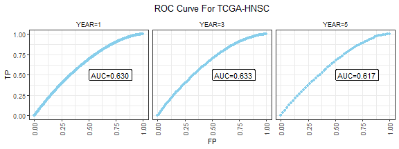
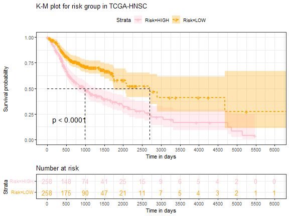

## Background
In this document, we demonstrate a two-stage marginal screening procedure with the false discovery rate (FDR) control in the context of right censored cancer survival data. Our screening procedure adopts the Expected Conditional Characteristic Function based Independent Criterion ($\textbf{ECCFIC}$)-correlation  proposed by Ke & Yin (2019) and the FDR control is based on the $\textbf{Knockoff}$ procedure proposed by Candes et al. (2018). Example data were obtained from the Cancer Genomic Atlas-Head and Neck Squamous Cell Carcinoma (TCGA-HNSCC) database
<a href="https://portal.gdc.cancer.gov/projects/TCGA-HNSC">(TCGA-HNSCC)</a>

## Head and Neck Squamous Cell Carcinoma Data
We used the normalized mRNA gene expression data for 516 patients with primary-solid tumors (HNSCC).Patients were subjected to right censoring (lost to follow up or no event until end of the study) with 57\% censoring rate. Each patients were followed up from entry into the study until event/censorship. The observed time (survival/censored) ranged between 2 to 6417 days with a median of 649.5 days.

After some initial cleaning(removing identical and repeated columns), we obtained a total of 17686 gene expression variables with no missing values.All the covariates were standardized with mean 0 and standard deviation 1 before further analysis.The standardized data are loaded below:


```r
#loading the cleaned data
hnsc_data<-readRDS("hnsc_data.rds")
dim(hnsc_data)
#> [1]   516 17688
hnsc_data[c(1:10),c(1:10)]
#>     time delta        A1BG       A2BP1      A2LD1      A2ML1        A2M      A4GALT        A4GNT
#> 437    2     1 -0.36812118 -0.26695648 -0.7557796 -0.2104381 -0.5944337  2.98646548  0.041806529
#> 312    2     1 -0.24330429 -0.26695648  0.9361634 -0.3262563  0.8707019 -0.01885084 -0.519259707
#> 359   11     1 -0.29176824  0.06981074 -0.7944521 -0.6607704 -0.3756029  1.54790534 -0.519259707
#> 425   11     0 -0.42904398 -0.26695648 -0.1383817  2.2580168 -0.5789091 -0.91277662 -0.237956423
#> 308   14     1 -0.47378760 -0.14889029  1.3442194 -0.2947017 -0.3729250 -0.55910776 -0.519259707
#> 406   14     0  0.05812901 -0.14959896 -0.5420032 -0.6606970 -0.7088000 -0.75167095 -0.519259707
#> 343   23     1 -0.47680276 -0.26695648  0.7797766 -0.2553674 -0.9331609  0.62981214 -0.519259707
#> 201   30     0 -0.29493688 -0.16215081 -0.5203897 -0.5256865  0.1453985  0.79095215 -0.005751248
#> 336   32     1 -0.31735573 -0.26695648  0.3000001  0.6937564 -0.1874275 -0.53353788 -0.519259707
#> 280   56     1 -0.12669050  0.46217312 -0.8087211 -0.6245018  0.7267917 -0.58391114 -0.519259707
#>           AAAS
#> 437  1.2226826
#> 312 -0.6943363
#> 359  1.2774273
#> 425 -0.9537918
#> 308  0.6075808
#> 406 -0.9014704
#> 343 -0.7586120
#> 201  0.9602115
#> 336 -0.1855898
#> 280  0.6403558
```
We see the first 10 rows and columns of the hnsc data. The first two columns show the "time" and "delta" respectively with delta=1 is the event (death). The rest of the columns are the mRNA gene expression covariates.\par

Next, we will perform the Screening (EECFIC-Screen) and screening with FDR control (ECCFIC-Knockoff) respectively.


## The Screening procedure:ECCFIC-Screen

For $\textbf{X}\in\mathbb{R}^{p}$ and $\textbf{Y} \in \mathbb{R}^{q}$ and a characteristic kernel function $K(.)$ ,the $\textbf{ECCFIC}$-correlation (Ke & Yin,2019) is defined as;


\[\rho(\textbf{X}|\textbf{Y})=\frac{\mathcal{H}(\textbf{X}|\textbf{Y})}{\mathcal{H}(\textbf{X}|\textbf{X})},\]  
where $\mathcal{H}$($\textbf{X}|\textbf{Y}$)$\equiv$ $E_Y$ $E_{X_i|Y}E_{X_j|Y}K(X_i,X_j)-E_{X_i,X_j}K(X_i,X_j), \hspace{2mm} i,j=1,2...n$.\

ECCFIC have two remarkable proerties:\
(a) $\rho(\textbf{X}|\textbf{Y})=0$ iff $\textbf{X}$ and $\textbf{Y}$ are independent &\
(b) $\rho(\textbf{X}|\textbf{Y})=1$ iff $X=f(Y)$\

These above properties were the motivation for using this statistic as a correlation measure to capture the linear/non-linear relationship between each predictor and the outcome variable.\


Now, for any survival time $T$, censoring time $C$, censoring indicator $\delta=I(T\leq C)$ and covariate matrix $\textbf{X}$,the screening algorithm is given below:


(1) $\textbf{Stage1}$: calculate the marginal ECCFIC correlation $\rho(.)$ between any predictor $X_m$ and $\delta$;
         \[\Omega_{m,1}=\rho_k(X_m|\delta)\]
         
(2) $\textbf{Stage2}$:Caclulate the ECCFIC correlation between $X_m$ and $Y$ given $\delta=s$. \[\Omega_{m,2}=\sum_{s=0}^{1}w_{s}\rho_k(X_m|Y,\delta=s),\hspace{2mm}w_{s}=Pr(\delta=s)\]


(3) Rank $(\Omega_{m,1},\Omega_{m,2})$ in descending order $(r_1,r_2)$\


(4) The estimated active set of predictors is then given by
$\widehat{\mathcal{A}}=\{1\le m \le p: \text{top}\hspace{2mm} d_n\hspace{2mm}\text{with}\hspace{2mm} min(r_1,r_2)\}$ with $n$ be the sample size & $d_n=\frac{n}{log(n)}$ (Fan & Lv,2008).\

The above procedure can be performed with the help of "ECCFIC-Screen" function. For demonstration purpose, we will use a subset of the TCGA-HNSC dataset.
The procedure is described below:


```r
#Loading required libraries
library(ESFDRC)
library(survival)
library(foreach)
library(stats)
library(knockoff)

# subsetting the hnsc-data
hnsc_sub<-hnsc_data[c(1:50),c(1:500)]
head(hnsc_sub[,c(1:5)])
#>     time delta        A1BG       A2BP1      A2LD1
#> 437    2     1 -0.36812118 -0.26695648 -0.7557796
#> 312    2     1 -0.24330429 -0.26695648  0.9361634
#> 359   11     1 -0.29176824  0.06981074 -0.7944521
#> 425   11     0 -0.42904398 -0.26695648 -0.1383817
#> 308   14     1 -0.47378760 -0.14889029  1.3442194
#> 406   14     0  0.05812901 -0.14959896 -0.5420032
```
For our screening analysis we select a subset of data with 50 rows and 500 columns,where the first two columns are "time" and "delta" and the rest are the covariates. To find out the important predictors
based on the sub data, we pass the necessary inputs into the function:


```r
time=hnsc_sub$time   #time
delta=hnsc_sub$delta  #censoring indicator
x_mat=hnsc_sub[,c(3:ncol(hnsc_sub))]   #covariate matrix/data frame
ranked_var<-ECCFIC_screen(time, delta, x_mat)
ranked_var[c(1:10),]
#>           X (time,X)|delta   (delta,X) final rank
#> 336   AFMID     0.06791427 0.098552385          1
#> 165     ACR     0.11681571 0.009663536          2
#> 323   AEBP2     0.11414260 0.026293130          3
#> 229  ADAM33     0.04674791 0.087912556          4
#> 82    ABHD3     0.05049783 0.084738528          5
#> 369  AGPHD1     0.11328018 0.014393230          6
#> 204  ACVR1B     0.05178325 0.072657799          7
#> 430 AKIRIN2     0.11322424 0.010333059          8
#> 383   AHDC1     0.11114313 0.026020214          9
#> 148   ACOT4     0.05716613 0.072443330         10
```
From the output, we can see that ECCFIC-Screen returns a sorted dataframe where the 1st columns (X) is the vector of covariates, 2nd and 3rd column calculates the stage(1) and stage (2) correlation as described above. Finally, column 4 provides the final rank of most important covariates based on the combined correlation of Stage(1) and stage (2). For example, in the sub data, AFMID,ACR and AEBP2 are the top three important predictors (Final ranks are 1,2 and 3 respectively).\


To Perform the screening with FDR control, we will briefly describe the Knockoff procedure followed by the ECCFIC-KNOCKOFF algorithm below:


## Screening with FDR control:ECCFIC-Knockoff
### Knockoff
$\tilde{\textbf{X}}=(\tilde{X_1},\tilde{X_2},...\tilde{X_p})$ is a knockoff copy of $\textbf{X}=(X_1, X_2,....X_p)$ if

* $\tilde{\textbf{X}} \perp \textbf{Y}|\textbf{X}$
* $f(\textbf{X},\tilde{\textbf{X}})=f(\tilde{\textbf{X}},\textbf{X})$ for the 1st two moments,
  - This can be done setting 
  $Corr((\textbf{X}_j),(\tilde{\textbf{X}_j}))=1-min(2\lambda_{min}(\Sigma),1)$ \hspace{2mm}where,$\lambda_{min}=$ minimum eigenvalue of $\Sigma=Cov(\textbf{X})$\

<span style="color:blue">The construction of above knockoff copies require  $n>=2p$ where $p=$ no. of covariates.</span>

## Algorithm:
* Split the data into $n_1$ & $n_2$ with $n_1<n_2$\

$\textbf{Screening-Step:}$\

* Apply ECCFIC on $n_1$, select $d=\frac{n_1}{log(n_1)}$ covariates.\

$\textbf{Knockoff-Step:}$\

* Create $\tilde{\textbf{X}}_d^{(n_2)}$ of ${\textbf{X}_d}^{(n_2)}$
* Knockoff matrix,  ${\tilde{\textbf{X}}_{d}}=\begin{bmatrix}
\textbf{X}_{d}^{(n_1)}  \\[5mm]
\tilde{\textbf{X}}_{d}^{(n_2)}
\end{bmatrix}$ \hspace{2mm} of\hspace{2mm} original ${\textbf{X}}_{d}=\begin{bmatrix}
\textbf{X}_{d}^{(n_1)}  \\[5mm]
\textbf{X}_{d}^{(n_2)}
\end{bmatrix}$\

* For each $j\in ({\tilde{\textbf{X}}_{d}},{\textbf{X}}_{d})$,Calculate two feature statistics:\

  + $W_{1,j}=\rho(X_j|\delta)-\rho(\tilde{X_j}|\delta)$\
  
  + $W_{2,j}=\sum_{s=0}^{1}w_{s}\rho(X_j|Y,\delta=s)-\sum_{s=0}^{1}w_{s}\rho(\tilde{X_j}|Y,\delta     =s)$\
  
*  For two given Thresholds $T_1$ & $T_2$ and a prespecified FDR $q$,obtain final active set of covariates,
    \[\hat{\mathcal{A}}_q=\{j:j\in d,W_{1,j}\ge T_1 \cup W_{2,j} \ge T_2\}\]
    where,  $T=\mathrm{min}\{t\in|W_j|>0:\frac{\#\{j:W_j\le -t\}}{\#\{j:W_j> t\}}\le q \}$


We will demonstrate the whole screening with FDR control procedure for our TCGA-HNSC data with the help of two functions. The 1st function is called "split_data" which will return two random subsets of a data based on $n_1$ and $n_2$.

```r
# we need to keep n1<n2 to meet the condition of knockoff
n1= 248 # user defined sample size for data set1.
n2=268 # user defined sample size for data set 2
rand_num= 3  # This will set a random seed to reproduce the same split
data=hnsc_data # A data frame with 1st column "time" and 2nd column "delta"
our<-split_data(hnsc_data, n1, n2, rand_num=3)
class(our)
#> [1] "list"
data_n1<-our[[1]]
dim(data_n1)
#> [1]   248 17688
data_n2<-our[[2]]
dim(data_n2)
#> [1]   268 17688
```
We see that the function split_data returns a list of two data frame. We name those data frames as "data_n1" and "data_n2".\

Note: The input data has to have 1st column as "time" and 2nd column as "delta". The censoring rate in the splitted data sets are kept similar as in the original data sets.


```r
sum(hnsc_data$delta==0)/nrow(hnsc_data) #57% censoring rate
#> [1] 0.5736434
sum(data_n1$delta==0)/nrow(data_n1)     #57% censoring rate
#> [1] 0.5725806
sum(data_n2$delta==0)/nrow(data_n2)     #57% censoring rate
#> [1] 0.5746269
```
Next, we will pass the two sub data into the "ESFDRC_func" which will perform both the screening and knockoff step as described in the algorithm and will return the final set of active predictors.

```r

data_n1= data_n1 #smaller of the two data
data_n2=data_n2  # larger of the two data
rand_num =2      # setting seed
q=.05            # FDR control level, usually .05 or .10
#s= number of covariates to be screened in the screening step. default is set up as round(nrow(data_n1)/log(nrow(data_n1)),0)

final_var<-ESFDRC_func(data_n1,data_n2,rand_num,q)
final_var
#>  [1] "BCORL2"  "BGN"     "CELSR3"  "HRNR"    "KCNK2"   "MASP1"   "NALCN"   "SUV39H2" "UTY"    
#> [10] "ZYG11A"
```
In the ECCFIC-Knockoff procedure, we get a final set of 10 gene expressions. Next, we fit a coxph model with the selected covariates and evaluate the predictive performance of the model based on the AUC values of 1-, 3- and 5- years survival.

```r
#####################ROC plot########################

#required libraries
library(risksetROC)
library(dplyr)
library(tidyr)
library(survminer)
library(purrr)

fit_data<-hnsc_data[,c("time","delta",final_var)]
#fitting cox model
model1<-coxph(Surv(time,delta) ~ ., data =fit_data,x=T,y=T)
summary(model1)
#> Call:
#> coxph(formula = Surv(time, delta) ~ ., data = fit_data, x = T, 
#>     y = T)
#> 
#>   n= 516, number of events= 220 
#> 
#>             coef exp(coef) se(coef)      z Pr(>|z|)    
#> BCORL2  -0.20952   0.81097  0.13374 -1.567 0.117189    
#> BGN      0.02049   1.02071  0.07380  0.278 0.781235    
#> CELSR3  -0.21738   0.80462  0.08802 -2.470 0.013519 *  
#> HRNR    -0.18102   0.83442  0.13524 -1.339 0.180713    
#> KCNK2   -0.03451   0.96608  0.08067 -0.428 0.668822    
#> MASP1   -0.31471   0.73000  0.13894 -2.265 0.023505 *  
#> NALCN    0.16805   1.18300  0.05095  3.298 0.000973 ***
#> SUV39H2 -0.04755   0.95357  0.07946 -0.598 0.549614    
#> UTY     -0.26459   0.76752  0.09957 -2.657 0.007875 ** 
#> ZYG11A  -0.06832   0.93396  0.10360 -0.659 0.509584    
#> ---
#> Signif. codes:  0 '***' 0.001 '**' 0.01 '*' 0.05 '.' 0.1 ' ' 1
#> 
#>         exp(coef) exp(-coef) lower .95 upper .95
#> BCORL2     0.8110     1.2331    0.6240    1.0540
#> BGN        1.0207     0.9797    0.8833    1.1795
#> CELSR3     0.8046     1.2428    0.6771    0.9561
#> HRNR       0.8344     1.1984    0.6401    1.0877
#> KCNK2      0.9661     1.0351    0.8248    1.1316
#> MASP1      0.7300     1.3699    0.5560    0.9585
#> NALCN      1.1830     0.8453    1.0706    1.3072
#> SUV39H2    0.9536     1.0487    0.8160    1.1143
#> UTY        0.7675     1.3029    0.6314    0.9329
#> ZYG11A     0.9340     1.0707    0.7623    1.1442
#> 
#> Concordance= 0.638  (se = 0.02 )
#> Likelihood ratio test= 54.1  on 10 df,   p=5e-08
#> Wald test            = 44.59  on 10 df,   p=3e-06
#> Score (logrank) test = 49.56  on 10 df,   p=3e-07

# caclulating risk score as linear predictor
marker1<-predict(model1,newdata = fit_data,type="lp")

auc1<-risksetROC(Stime=fit_data$time, status=fit_data$delta,
                 marker=marker1, predict.time=365, method="Cox" ,plot =FALSE)$AUC #1year AUC

auc2<-risksetROC(Stime=fit_data$time, status=fit_data$delta,
                 marker=marker1, predict.time=1095, method="Cox" ,plot =FALSE)$AUC #3year AUC

auc3<-risksetROC(Stime=fit_data$time, status=fit_data$delta,
                 marker=marker1, predict.time=1825, method="Cox" ,plot =FALSE)$AUC #5year AUC


## Define a helper functio nto evaluate at var1ious t
risksetROC_helper <- function(t) {
  risksetROC(Stime        = fit_data$time,
             status       = fit_data$delta,
             marker       = marker1,
             predict.time = t,
             method       = "Cox",
             plot         = FALSE)
}
## Evaluate 1,3,5 years 
risksetROC_data <- data_frame(t = 365 * c(1,3,5)) %>%
  mutate(risksetROC = map(t, risksetROC_helper),
         ## Extract scalar AUC
         auc = map_dbl(risksetROC, magrittr::extract2, "AUC"),
         ## Put cut off dependent values in a data_frame
         df_risksetROC = map(risksetROC, function(obj) {
           ## marker column is too short!
           marker <- c(-Inf, obj[["marker"]], Inf)
           bind_cols(data_frame(marker = marker),
                     as_data_frame(obj[c("TP","FP")]))
         })) %>%
  dplyr::select(-risksetROC) %>%
  unnest() %>%
  arrange(t, FP, TP)

## Plot
risksetROC_data %>%
  ggplot(mapping = aes(x = FP, y = TP)) +
  geom_point(color="skyblue") +
  geom_line(color="skyblue") + 
  geom_label(data = risksetROC_data %>% dplyr::select(t,auc) %>% unique,
             mapping = aes(label = sprintf("AUC=%.3f", auc)), x = 0.7, y = 0.5) +
  facet_wrap( ~ sprintf("YEAR=%.0f", t/365)) +
  theme_bw() +
  theme(axis.text.x = element_text(angle = 90, vjust = 0.5),
        legend.key = element_blank(),
        plot.title = element_text(color="black",hjust = 0.5),
        strip.background = element_blank())+labs(title = "ROC Curve For TCGA-HNSC")
```




We see that AUC values for 1,3 and 5 years are 0.63,0.63 and 0.62 respectively, which indicates that our model performs well in predicting the overall survival.\

Finally, we divide the patients into "Low" and "High" Risk group based on the median risk score
and plot KM plot to see if our model can significantly distinguish between the two groups.

```r

fit_data$risk_score<-marker1 
fit_data$Risk<-ifelse(fit_data$risk_score>=median(marker1),"HIGH","LOW")
fit <- survfit(Surv(time,delta)~Risk, data = fit_data)

ggsurvplot(fit,
           pval = TRUE, conf.int = TRUE,
           title="K-M plot for risk group in TCGA-HNSC",
           risk.table = TRUE, # Add risk table
           risk.table.col = "strata", # Change risk table color by groups
           xlab = "Time in days",   # customize X axis label.
           break.time.by = 500, 
           linetype = "strata", # Change line type by groups
           surv.median.line = "hv", # Specify median survival
           ggtheme = theme_bw(), # Change ggplot2 theme
           
           palette = c("pink", "orange"))
```



```r

##log-rank test
surv_diff <- survdiff(Surv(time, delta) ~ Risk, data = fit_data)
surv_diff
#> Call:
#> survdiff(formula = Surv(time, delta) ~ Risk, data = fit_data)
#> 
#>             N Observed Expected (O-E)^2/E (O-E)^2/V
#> Risk=HIGH 258      143      105      14.0        27
#> Risk=LOW  258       77      115      12.7        27
#> 
#>  Chisq= 27  on 1 degrees of freedom, p= 2e-07
```
From the log-rank test, we see that the test is significant (p-value<.001) which again shows that our selected covariates perform well in distinguishing low and high risk patients.
